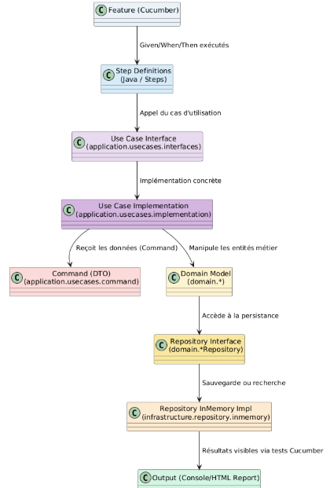

# Architecture du projet – Prescription Management System

Ce document décrit la structure logicielle du projet UYP-PMS (Umelaphi Yaodian Pharmacy Prescription Management System) développée selon les principes du Domain-Driven Design (DDD).

## Structure du code

Le projet est organisé en quatre couches principales :

| Couche | Description |
|--------|--------------|
| **application/** | Contient les cas d’utilisation (`usecases`), les commandes (`command`) et leurs implémentations (`implementation`). |
| **domain/** | Regroupe les entités, value objects, factories et repositories (logique métier pure). |
| **infrastructure/** | Contient les implémentations concrètes (ex. repositories *InMemory*). |
| **test/** | Contient les contrats Cucumber (.feature) et leurs step definitions pour valider les cas d’utilisation. |

---

##  Diagramme d’architecture



Ce diagramme illustre le flux complet d’un scénario Cucumber à travers les couches du système :

1. Les **fichiers `.feature`** décrivent les cas d’utilisation en langage naturel. (src\test\resources\contracts)
2. Les **Step Definitions** traduisent ces scénarios en actions concrètes. (src\test\java\steps)
3. Les **Use Cases** reçoivent les données via des **Command DTOs** et orchestrent la logique métier.(src\main\application\usecases)
4. Le **Domain Model** applique les règles de gestion à l’aide des entités et value objects. (src\main\domain)
5. Les **Repositories** assurent la persistance (ici simulée en mémoire). (src\main\infrastructure)
6. Les **tests Cucumber** valident l’ensemble et génèrent un rapport HTML (`build/reports/cucumber.html`).

---

## Exécution des tests

Pour exécuter les tests Cucumber :

```bash
gradlew test
